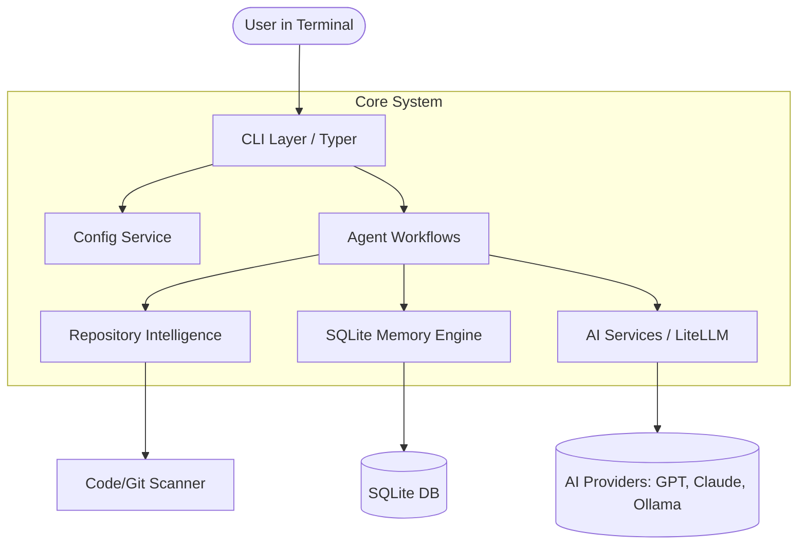

# ⚡ Zero Action - The Complete Master Guide

Welcome to the **Definitive Master Guide** for **Zero Action**. This document is a comprehensive, deep-dive technical manual designed to help developers, contributors, and users understand *every single aspect* of the Zero Action ecosystem.

From high-level architecture to the lowest-level performance optimizations, installation guides, and advanced use-case scenarios, everything you need to master Zero Action is here.

---

## 1. What is Zero Action?

Zero Action is a **CLI-first AI Development Partner**. It is designed to act as your Architect, Senior Engineer, Code Reviewer, and Auto-Fixer directly inside your terminal.

Unlike standard code autocomplete extensions (like GitHub Copilot), Zero Action:
1. **Reads your entire repository context** (frameworks, dependencies, Git history).
2. **Maintains persistent memory** across sessions using SQLite (remembering architectural decisions).
3. **Executes complex multi-agent workflows** (e.g., Plan → Architect → Code → Review → Fix).
4. **Keeps the human in the loop** by presenting surgical diff previews before ever writing to disk.

### The Tech Stack
- **CLI Framework:** Typer (Built on Click)
- **Terminal UI:** Rich (For tables, panels, markdown, and dynamic spinners)
- **AI Abstraction:** LiteLLM (Supports OpenAI, Anthropic, Gemini, Groq, Ollama, etc.)
- **Persistent Storage:** SQLite (For sessions, project metadata, and decision memory)
- **Package Manager:** `uv` (For blazing-fast dependency resolution)
- **Static Analysis & Testing:** `pytest`, `ruff`, `mypy`

---

## 2. Installation & Setup

Zero Action is built for modern Python environments. It is highly recommended to use `uv` for the fastest installation.

### Prerequisites
- Python 3.12 or higher.
- `uv` (Astral's fast Python package installer and resolver).
- Git.

### Local Development Setup
1. Clone the repository:
   ```bash
   git clone https://github.com/your-org/zero-action.git
   cd zero-action
   ```
2. Sync dependencies using `uv`:
   ```bash
   uv sync
   ```
3. Run the CLI:
   ```bash
   uv run zero --help
   ```

### Global Installation
If you want to use `zero` globally across any project on your machine:
jela
```

---

## 3. System Architecture

Zero Action uses a strict **Modular, Domain-Driven Design**. The separation of concerns ensures that the CLI is just a thin presentation layer, while the heavy lifting is handled by backend services.

### High-Level Flow Diagram



### Directory Structure & Responsibilities

```text
zero/
├── cli/          # 🖥️ CLI Layer: Command routing, CLI argument parsing. NO business logic.
├── core/         # ⚙️ Core Utils: Shared UI tools (Streaming spinner), Custom Exceptions.
├── services/     # 🛠️ Services: Config manager (TOML), Logging (Loguru), AI Service wrapper.
├── repository/   # 🔍 Repository: Scans for languages, dependencies, Docker, and Git states.
├── memory/       # 🧠 Memory: SQLite wrappers for Sessions, Decisions, and Global knowledge.
├── providers/    # 🌐 Providers: Abstract classes wrapping LiteLLM.
├── prompts/      # 📝 Prompts: Markdown files defining AI behavior (planner, coder, reviewer).
└── models/       # 📦 Data Models: Pydantic schemas for strict typing.
```

---

## 4. Comprehensive Command Reference

Zero Action supports the full software development lifecycle natively in the terminal.

### Setup & Context
- **`zero setup`**: Interactive wizard to configure AI provider endpoints, API keys, and default models. Tests the API connection before saving to `~/.zero/providers.toml`.
- **`zero init`**: Scans the current working directory. Detects languages (Python, TS, Go), frameworks (FastAPI, React), package managers (npm, uv), and Git history. Caches this "Project Context" for the AI.

### Interaction
- **`zero ask`**: One-shot Q&A command. Useful for quick questions like `zero ask "Where is the database connection string?"`.
- **`zero chat`**: An interactive REPL loop (Claude Code style). Features slash commands, streaming UI, and conversational history.

### The Agentic Workflow
- **`zero plan`**: The "Product Manager". Takes a raw idea (`--requirements`) and generates a structured Product Requirements Document (PRD).
- **`zero architect`**: The "Software Architect". Reads the PRD and designs system architecture diagrams, tech stacks, and database schemas.
- **`zero code`**: The "Senior Engineer". Reads the PRD and Architecture spec, and generates fully typed, production-ready code files.
- **`zero review`**: The "Security/QA Lead". Scans generated files for security vulnerabilities, performance bottlenecks, and maintainability issues. Outputs a review report.
- **`zero fix`**: The "Auto-Fixer". Reads error logs or review reports, presents a unified diff of the required changes, and waits for user confirmation before applying the fix.
- **`zero test`**: The "QA & Auto-Healer". Runs test runners/linters in the background, parses errors/tracebacks to target failing files, and applies fixes in an iterative autonomous healing loop.
- **`zero pr`**: The "Git & DevOps Auto-Pilot". Automatically scans git diffs, creates descriptive branches, drafts Conventional Commit messages, pushes to origin, and creates Pull Requests.

### System Management
- **`zero provider`**: Manage active AI endpoints, add custom models, switch default providers, or remove API keys.
- **`zero memory`**: Interface with the SQLite database to view past session histories, project metadata, and enforce global rules.
- **`zero config`**: View and set system-level configs (like debug mode, logging levels).

---

## 5. Advanced Use Cases & Workflows

### Scenario 1: Bootstrapping a New Project from Scratch
When starting a new project, Zero Action guides you from idea to code:
1. `zero init` (Establishes the empty workspace context).
2. `zero plan --requirements "Build a FastAPI microservice for user authentication with JWT"`
   *(This generates `docs/prd.md`)*
3. `zero architect` 
   *(Reads the PRD and generates `docs/architecture.md` with system design)*
4. `zero code`
   *(Reads the architecture and writes the actual `main.py`, `models.py`, and `routes.py`)*

### Scenario 2: Legacy Code Refactoring
Zero Action is excellent for cleaning up technical debt:
1. `zero review --file legacy_payment_gateway.py --focus "security, readability"`
   *(Generates a markdown review highlighting critical flaws)*
2. `zero fix --file legacy_payment_gateway.py --review docs/review.md`
   *(Zero Action automatically patches the flaws, shows you a surgical diff, and asks `Apply this fix? [Y/n]`)*

### Scenario 3: Enforcing Corporate AI Constraints
If your company has strict coding standards (e.g., "Always use `Pydantic v2` and never use `datetime.utcnow()`"):
1. Edit `zero/prompts/coder.md` or `zero/prompts/master_prompt.md`.
2. Add your corporate constraints directly to the Markdown file.
3. Zero Action will parse these constraints into its system prompt instantly on the next command execution.

### Scenario 4: Self-Healing Failing Test Suites
If your test suite or linter checks are failing:
1. Run `zero test --command "pytest"` (or run `/test ruff check` inside REPL).
2. Zero Action captures the command failure output, identifies the failing source file from the traceback, fetches the fix, shows a diff, writes the patch, and re-runs the tests iteratively up to `--max-iterations` until the codebase is fully healed.

### Scenario 5: Automated Conventional Commit, Push, and PR Checkout
When you have finished adding a feature or fixing a bug:
1. Run `zero pr` (or run `/pr` inside REPL).
2. Zero Action automatically analyzes your git diff, drafts a Conventional Commit message, suggests a clean branch name, checks out the branch, stages all changes, commits them, pushes to `origin`, and opens a PR using the `gh` CLI (or generates a clickable compare URL).

---

## 6. Deep Dive: Memory & Context Engine

Zero Action does not rely on simple conversational history. It uses a **multi-tiered memory system** backed by SQLite.

### Memory Types
1. **Session Memory:** The short-term conversational history of a `zero chat` instance.
2. **Project Memory:** Information discovered during `zero init` (Tech stack, folder structure).
3. **Decision Memory:** Key architectural decisions explicitly saved so the AI doesn't forget them (e.g., "We are using Postgres instead of MySQL").
4. **Global Memory:** User-level preferences applied to *all* projects (e.g., "Always use tabs instead of spaces").

When you execute a command like `zero code`, the Context Engine dynamically injects relevant Project and Decision memory into the prompt, ensuring the AI writes code that fits your specific codebase.

---

## 7. Deep Dive: UI & UX Design

Zero Action emphasizes a premium, developer-first experience inspired by top-tier modern CLI tools (like Claude Code).

### The Startup Interface
When launching `zero chat`, users are greeted with a high-fidelity startup screen:
- **Colors:** Crimson Red (`#DC143C`), Navy Blue (`#0047AB`), and Gold typography.
- **Interactive Gate:** Waits for the user to press a key before dropping them into the clean REPL loop, preventing terminal clutter.

### The "Thinking" Loader (Dynamic Streaming)
Instead of a static "Waiting..." message, `zero/core/ui.py` implements a sophisticated streaming handler:
- **Dynamic Spinner:** Uses the `⠋` spinner animation.
- **Real-Time Latency Tracking:** Displays a live timer `Thinking (1.5s)...` to show how long the AI model is taking to compute the first token (Time-To-First-Token).
- **Markdown Streaming:** Once the AI starts responding, the spinner disappears, and the response is streamed directly into the terminal with rich Markdown formatting (tables, code blocks, bold text).

---

## 8. Deep Dive: Sub-300ms Lazy-Loading Performance

One of Zero Action's most critical architectural achievements is its **blazing-fast CLI boot time (< 300ms)**.

### The Problem
AI CLIs often suffer from slow startup times (2-3 seconds) because importing heavy libraries (`litellm`, `sqlite3`, `pydantic`, API wrappers) at the top of Python files forces the interpreter to load them immediately—even if the user just ran `zero --help`.

### The Solution: Scoped Lazy-Imports & `TYPE_CHECKING`
Zero Action solves this by strictly banning global imports of heavy services in the `cli/` layer.

**How it works:**
1. We use Python's `typing.TYPE_CHECKING` block to import heavy classes globally *only* for static analyzers (`mypy`/IDE). This costs 0ms at runtime.
2. We import the actual implementation *inside* the execution body of the Typer command.

```python
import typer
from typing import TYPE_CHECKING
from zero.core.ui import stream_completion_with_timer # Lightweight UI is OK globally

# 1. Zero-cost type hinting for Mypy and your IDE
if TYPE_CHECKING:
    from zero.services.ai import AIService
    from zero.memory.manager import MemoryManager

app = typer.Typer()

@app.command()
def generate(query: str):
    # 2. Heavy imports happen HERE, only when the command actually runs!
    from zero.services.ai import AIService
    from zero.memory.manager import MemoryManager
    
    ai_service = AIService()
    ai_service.process(query)
```
**Result:** `zero --help`, `zero --version`, or simple commands execute instantaneously.

---

## 9. Troubleshooting & FAQ

### **Q: I'm getting a "LiteLLM Connection Timeout" error.**
**A:** This usually means your AI provider is down or your API key is invalid. 
- Try running `zero setup` again.
- Run `zero provider test` to verify your connection natively.

### **Q: SQLite Database is Locked.**
**A:** Zero Action uses SQLite for memory management (`~/.zero/memory.db`). If you run multiple instances of `zero chat` in parallel, SQLite might lock the database. Make sure you only have one interactive session running for a specific project.

### **Q: My custom local LLM is generating garbage output.**
**A:** Ensure your local LLM uses the correct chat template. If you are using Ollama, run `zero setup`, select `Ollama`, and ensure the exact model name (e.g., `llama3.1`) is typed correctly.

---

## 10. Developer Guide: Extending Zero Action

Zero Action is highly extensible. Here is how you can customize it:

### 1. Modifying AI Behavior (No Python Required)
Zero Action uses a **Template-Driven Architecture**. All system instructions and behavioral constraints live in `zero/prompts/*.md`.
- Want the AI to write more aggressive Security Reviews? Edit `zero/prompts/reviewer.md`.
- Want the PRD output to include a "Marketing Strategy" section? Edit `zero/prompts/planner.md`.
*Changes take effect immediately without recompiling or restarting.*

### 2. Adding a New CLI Command
1. Create a new file `zero/cli/commands/my_command.py`.
2. Use `@app.command()` from Typer.
3. **Remember the Golden Rule:** Lazy-load any heavy imports (`AIService`, `MemoryManager`, Database connections) inside the function.
4. Import and attach your command to the main Typer app in `zero/cli/app.py`.

### 3. Adding a Custom AI Provider
You don't need to write code to support new AI models! Zero Action uses `LiteLLM`, which supports any OpenAI-compatible API out of the box.
1. Run `zero setup`.
2. Select `OpenAI-Compatible` or `Custom`.
3. Provide the `Base URL` (e.g., your local vLLM server, LM Studio, or a new cloud provider) and the API Key.

---

## 11. Quality Assurance & Testing Standards

To maintain production-grade reliability, all pull requests and code modifications must pass the following pipeline:

1. **Unit & Integration Tests (`pytest`)**
   ```bash
   uv run pytest
   ```
   *Expectation: 100% pass rate. (Currently 81 tests covering config, memory, AI services, and CLI execution).*

2. **Linting & Formatting (`ruff`)**
   ```bash
   uv run ruff check zero tests
   uv run ruff format zero tests
   ```
   *Expectation: 0 warnings. Enforces strict PEP-8 compliance and modern Python idioms.*

3. **Static Type Checking (`mypy`)**
   ```bash
   uv run mypy zero tests
   ```
   *Expectation: Fully typed. Zero Action relies heavily on Pydantic and Mypy to catch structural bugs before runtime.*

---
**Zero Action** — *Think Less. Build More.*
